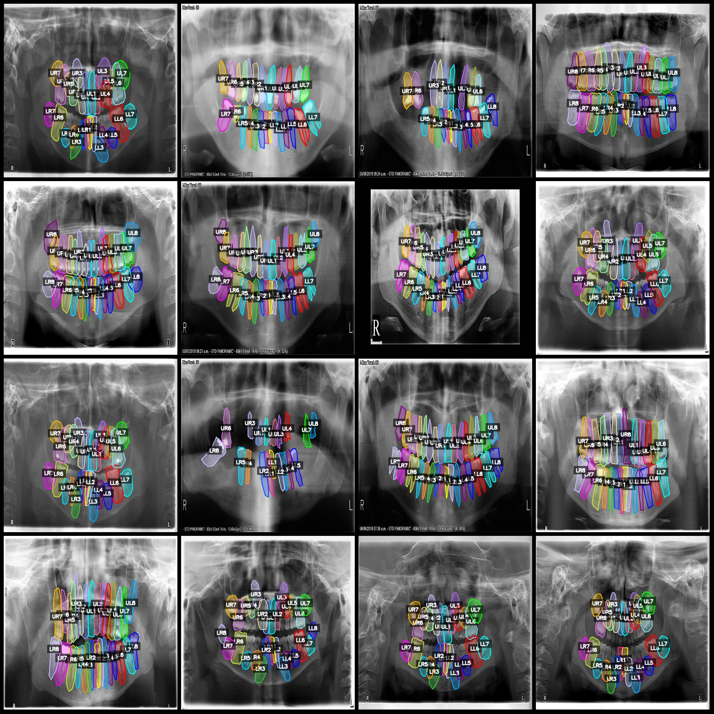
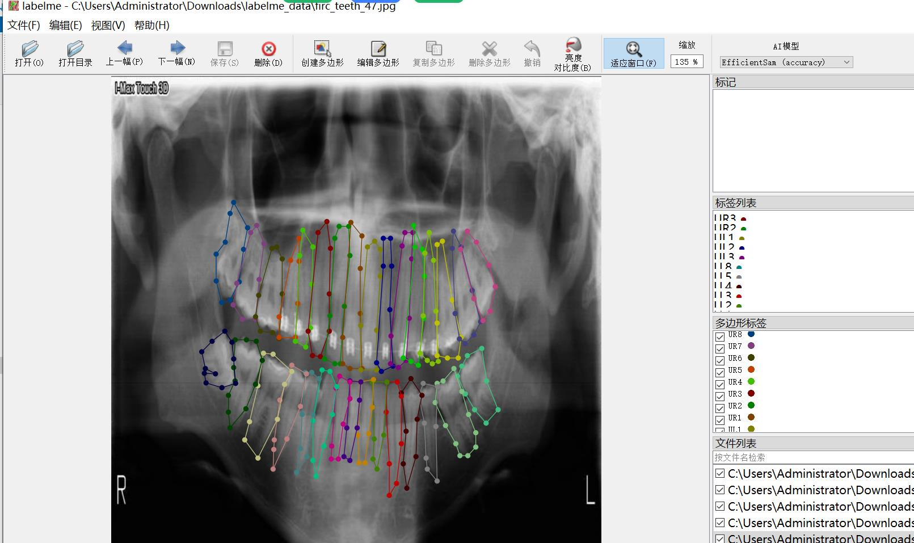

# Intelligent Healthcare: Dental Type Identification and Location Recognition Segmentation Dataset with 32 Categories in LabelMe Format - 3971 Images

Please note that this is a recognition of teeth without any dental diseases included. Please check the image.
The dataset format is labelme format, which does not include a maskfile and only contains jpgimage and the corresponding jsonfile.
The number of jpg files: 3971
annotation count: 3971  
annotationnumber of classes: 32  
annotation class names:["LL1","LL2","LL3","LL4","LL5","LL6","LL7","LL8","LR1","LR2","LR3","LR4","LR5","LR6","LR7","LR8","UL1","UL2","UL3","UL4","UL5","UL6","UL7","UL8","UR1","UR2","UR3","UR4","UR5","UR6","UR7",
"UR8"]  
boxes per class:   
LL1 count = 3926  
LL2 count = 3943  
LL3 count = 3953  
LL4 count = 3876  
LL5 count = 3781  
LL6 count = 3480  
LL7 count = 3702  
LL8 count = 2602  
LR1 count = 3930  
LR2 count = 3924  
LR3 count = 3952  
LR4 count = 3890  
LR5 count = 3800  
LR6 count = 3493  
LR7 count = 3712  
LR8 count = 2581  
UL1 count = 3879  
UL2 count = 3828  
UL3 count = 3882  
UL4 count = 3714  
UL5 count = 3663  
UL6 count = 3678  
UL7 count = 3783  
UL8 count = 2488  
UR1 count = 3877  
UR2 count = 3837  
UR3 count = 3878  
UR4 count = 3713  
UR5 count = 3691  
UR6 count = 3703  
UR7 count = 3776  
UR8 count = 2420  
total boxes: 116355  
Using the annotation tool: labelme=5.5.0
image resolution: 640x640  
Annotation rules: Draw a polygon around the class for polygon.
Important notes: You can open and edit the dataset using LabelMe, and you need to convert the JSON dataset into a format like mask, yolo, or coco for semantic segmentation or instance segmentation.
Special statement: This dataset does not guarantee the accuracy of the trained model or weight file.
Image preview:
## Images

Here is a pay link on Stripe ( https://buy.stripe.com/3cs8yP7sY87d0vu9AB ). Please contact me lonlonago@foxmail.com after funding $89, and I will send you a complete data files , thank you!

